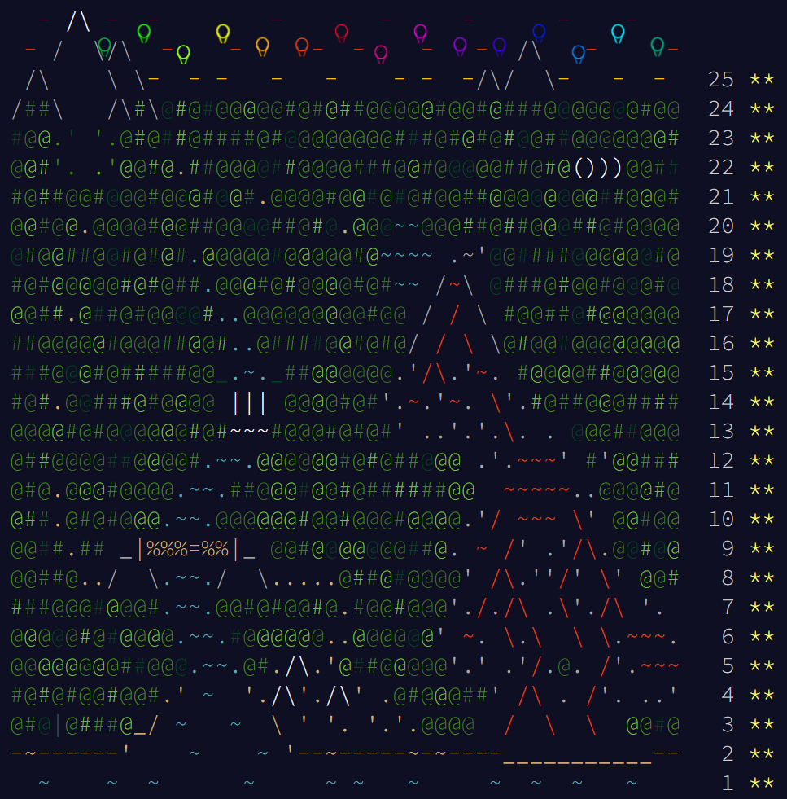

# Advent of Code

Here you can find my solutions to [Advent of Code](https://adventofcode.com) - Advent calendar for nerd programmers,
who prefer solve algorithm puzzles above anything.

Unfortunately, I don't do it in astonishing short times. Instead, I try to make my solutions simple and clear, without any sophisticated,
language specific constructions (it's only Java after all 🙃), so it can be readable and understandable by beginners.
Sometimes I write even some comments if something is not clear.

Code should compile under Java 17 with gradle. Every year has its own package, and every day its own (and only one) class.
Inputs are stored in `input` directory - one dir per year and one txt file per day.

_Good luck with solving Advent of Code puzzles._

## Fun

In `fun` directory I place some solutions which are written in other languages (just for fun), for example [Rockstar language](https://codewithrockstar.com/) - code looks like rockstar ballade.

