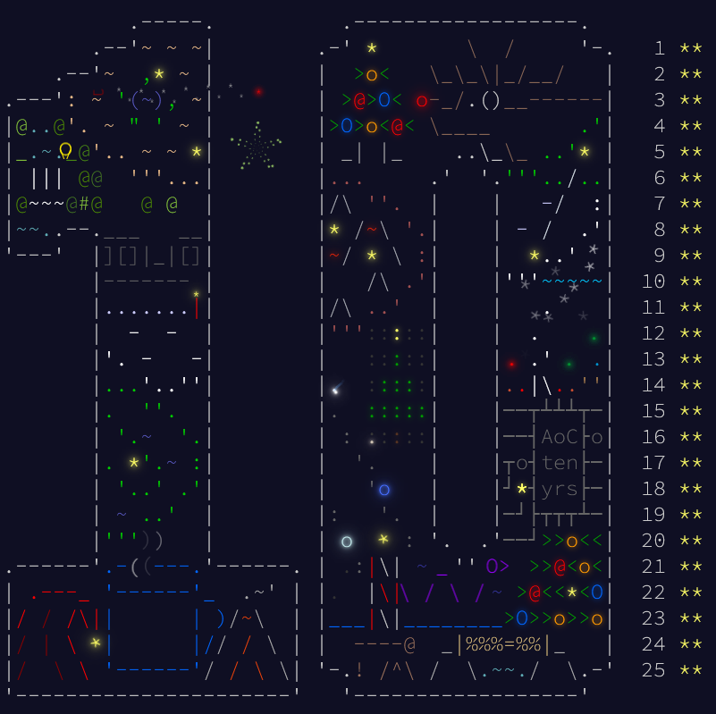

# Advent of Code

Here you can find my solutions to [Advent of Code](https://adventofcode.com) - Advent calendar for nerd programmers,
who prefer solve algorithm puzzles above anything.

I don't intend to make it to leaderboard - first of all I would have to get up at 6 a.m CET (which I don't intend to).
Instead, I try to make my solutions simple and clear, without any sophisticated, language specific constructions.
To keep things a little more interesting I use Java and C++ for my solutions. 

Java solutions are located in `main/java` directory. Code should compile under Java 17 with gradle. 
C++ solutions are located in `main/cpp` directory. Code should compile with C++ 26 and CMake >= 3.27.

Every year has its own package/directory, and every day its own (and only one) class/file.
Inputs are stored in `input` directory - one dir per year and one txt file per day. I don't share input
(as it is forbidden due to copyrights). In order to run a solution you have to copy your input
(**without new line at the end of file**) into `input/yearYYYY/dayDD.txt` file.

_Good luck with solving Advent of Code puzzles._

## Fun

In `fun` directory I place some solutions which are written in other languages (just for fun), for example [Rockstar language](https://codewithrockstar.com/) - code looks like rockstar ballade.

